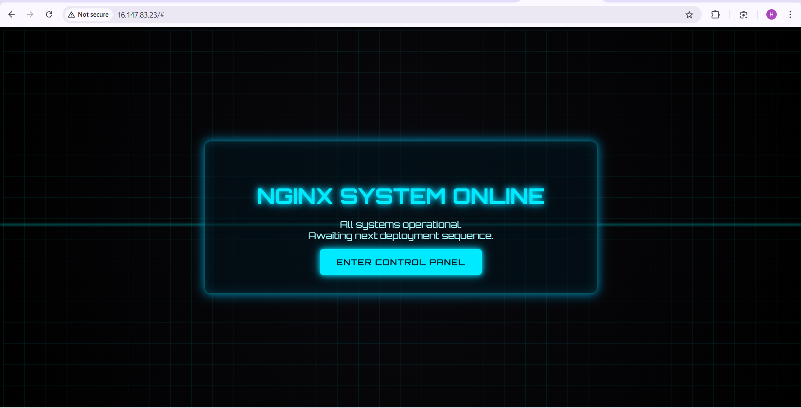

## DAY 8 task ###

Commands Used
- First I created a vm using aws console. Create a pem file for connecting to the machine using ssh.

- given permission to the downloaded file
- ssh -i command copied from console
* Now updating the server
- sudo apt-get update
- sudo apt-get nginx -y
- systemctl status nginx.service (to check the service running)
- to check the nginx on web got to aws>security groups>add rule>port 80>give name to rule>save
- now to got url and use public ip of the server as
http://publicip:80 > to access the webpage
Webpage for ngnix looked like below (Taken one of the html file from gpt)

====================

## To check the logs og the nginx ##

Logs of nginx will be stored in /var/log/nginx

access.log  error.log

** to take these logs in a file 

I copied content from this access.log to a new file
touch /home/ubuntu/nginx_logs

cat access.log > /home/ubuntu/nginx_logs
or cp also can be used

===============

## Now task is to take the file from remote to local ##

As mentioned took help from command

scp -i your-key.pem ubuntu@<your-instance-ip>:~/nginx-logs.txt .

- my .pem key i used and instance ip i used public ip
- logs of nginx were copied at location /home/ubuntu/nginx_logs

Attaching the log file in folder

========================================================

#### Challenges Faced ####

scp -i command was not working for as I was not using correct name of the nginx log file on server.

To copy the output of logfile to a new file used google.

######################

# Learning

- To permit access any ip by using the inbound rules
- The webpage of the nginx can be changed.
- How i can take any file from remote to local using scp protocol.

####

SCP protocol - Secure Copy Protocol 
Using scp files can be moved from local to remote.